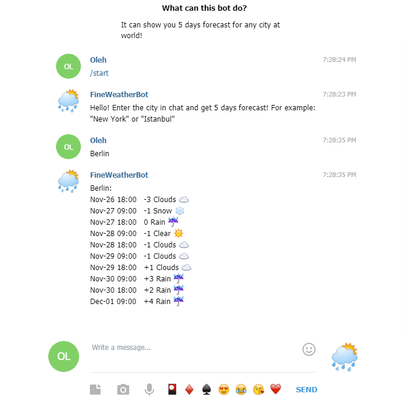

Simple Telegram 5 days weather forecast bot. It gets data from the [OpenWeatherMap](https://openweathermap.org/api) free API.

Created with unofficial ["TelegramBots"](https://github.com/rubenlagus/TelegramBots/tree/master/telegrambots-abilities) API.

Uses [Jackson](https://github.com/FasterXML/jackson) library to parse JSON data.

Project deployed at Heroku and available most of the time. You can test it by adding @denifoBot in Telegram. 

